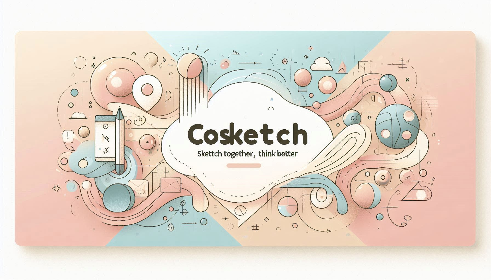

# CoSketch Frontend

CoSketch Frontend is a **real-time collaborative drawing application** built with **Next.js 15**, **React 19**, and **Bun** as the package manager. It is part of the **CoSketch monorepo** managed using **Turborepo**.

## 🚀 Features

- **Real-time collaboration** with WebSockets
- **Next.js 15** with **Turbopack** for fast development
- **Tailwind CSS 4** for styling
- **React Query 5** for state management
- **Optimized for performance** and responsive design

## 🏗 Folder Structure

```sh
cosketch-frontend/
├── public/ # Static assets
│   ├── favicons/ # Favicon images
│   ├── images/ # Logos and banners
├── src/
│   ├── api/ # API calls
│   ├── app/ # App routing structure
│   ├── components/ # Reusable components
│   ├── config/ # App-wide configurations
│   ├── data/ # Static data (icons, metadata, etc.)
│   ├── higher-order-component/ # HOCs for authentication
│   ├── hook/ # Custom React hooks
│   ├── lib/ # Third-party library integrations
│   ├── styles/ # Global styles
├── package.json # Project dependencies
├── next.config.ts # Next.js configuration
├── postcss.config.mjs # PostCSS configuration
├── tailwind.config.ts # Tailwind CSS configuration
└── tsconfig.json # TypeScript configuration
```

## 📦 Tech Stack

- **Next.js 15** → Frontend framework
- **React 19** → UI library
- **Tailwind CSS 4** → Styling
- **Bun** → Fast JavaScript runtime & package manager
- **React Query 5** → State management
- **Lucide-react** → Icon library
- **Zod** → Schema validation

## 📜 Scripts (package.json)

```json
{
  "scripts": {
    "dev": "next dev --turbopack",
    "build": "next build",
    "start": "next start",
    "lint": "next lint",
    "lint:fix": "next lint --fix && prettier --write ."
  }
}
```

## 🛠️ Getting Started

### 1️⃣ Install Dependencies

Ensure **Bun** is installed on your system:

```sh
bun install
```

### 2️⃣ Run the Development Server

```sh
bun run dev
```

### 3️⃣ Build and Start Production Server

```sh
bun run build
bun run start
```

## 📸 UI Preview



🚀 **"Sketch Together, Think Better."**
