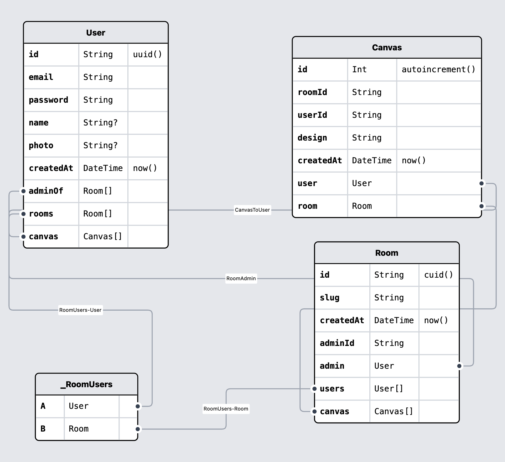

# CoSketch Database

This package manages the database setup, migrations, and interactions for the CoSketch application using **Prisma** and **PostgreSQL**.

## 📌 Overview

This module is part of the CoSketch monorepo and provides database access to other services within the application.



## 📂 Project Structure

```sh
CoSketch/database
│── prisma/          # Prisma schema and migrations
│   ├── schema.prisma  # Database schema
│   ├── migrations/    # Migration files
│── src/            # Database service layer
│   ├── services/   # Database services
│   │   ├── userService.ts
│   │   ├── roomService.ts
│   │   ├── canvasService.ts
│── index.ts        # Database connection setup
│── package.json    # Package configuration
│── README.md       # Project documentation
```

## 🛠️ Installation

Ensure you have **Bun** installed, then install dependencies:

```bash
bun install
```

## 🛠️ Database Setup

### Start the Database

Run this in root the database using **Docker Compose**

```bash
bun run db:up # Start the database container
```

Or manually start PostgreSQL if not using Docker.

### Stop the Database

```bash
bun run db:down # Stop the running database container
```

## 🔄 Prisma Setup

### Generate Prisma Client

Run this before executing queries:

```bash
bun run generate
```

### Apply Migrations

To apply the latest schema changes:

```bash
bun prisma migrate deploy
```

### Reset the Database (⚠️ Destructive Action)

To reset and reapply migrations:

```bash
bun run reset
```

Open Prisma Studio

For an interactive database UI:

```bash
bun run studio
```

## 🚀 Running the Project

Make sure the database is running before starting the backend services:

## 📌 Notes

- Ensure **`DATABASE_URL`** is correctly set in your environment variables.
- This package is a part of a **Turborepo monorepo setup**.
- **Prisma** is used for ORM and database management.

Your database is now ready to use! 🚀
